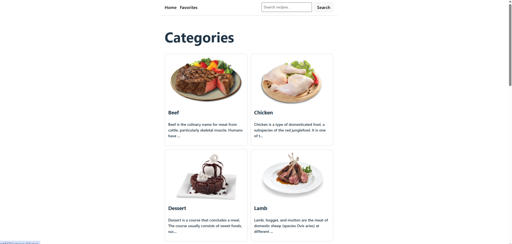

# Project Title

Recipe Discovery App

# My Solution ScreenShot

# Link

# Description

The Recipe Discovery App is a React + TypeScript application that allows users to explore recipes using data from TheMealDB API. Users can browse recipe categories, view meals within a category, search for recipes by name, view detailed recipe information, and save their favorite recipes for later.

The app focuses on clean structure, beginner-friendly code, reusable components, and proper state management using React hooks and context.

# Features

Browse recipe categories

View meals by category

Search for recipes by name

View detailed recipe information:

Image

Category & origin

Ingredients

Instructions

Add / remove favorites

Favorites persist using localStorage

Client-side routing with React Router

# Tech Stack

React

TypeScript

Vite

React Router

TheMealDB API

# Reflection

Most Challenging Part

The most challenging part of this project was handling React hook rules and TypeScript type safety at the same time.
Specifically:

Ensuring hooks like useFetch were never called conditionally. Safely working with route parameters (useParams) that can be undefined. Structuring the Favorites context so it worked correctly with Fast Refresh and ESLint rules. Solving these issues required understanding how React renders components and how TypeScript narrows types through control flow.

One important design decision was to create a reusable useFetch custom hook instead of fetching data directly inside each component. I chose this approach because it avoided duplicating fetch, loading, and error logic across multiple pages. It kept page components focused on UI rendering, no data logic. it also make the code easier to read and debug and maintain.

Another key decision was storing only recipe IDs in the Favorites context and fetching full recipe details when needed. This kept global state lightweight while still allowing full recipe information to be displayed.

# Acknowledgements

TheMealDB API 

https://www.themealdb.com/api.php

